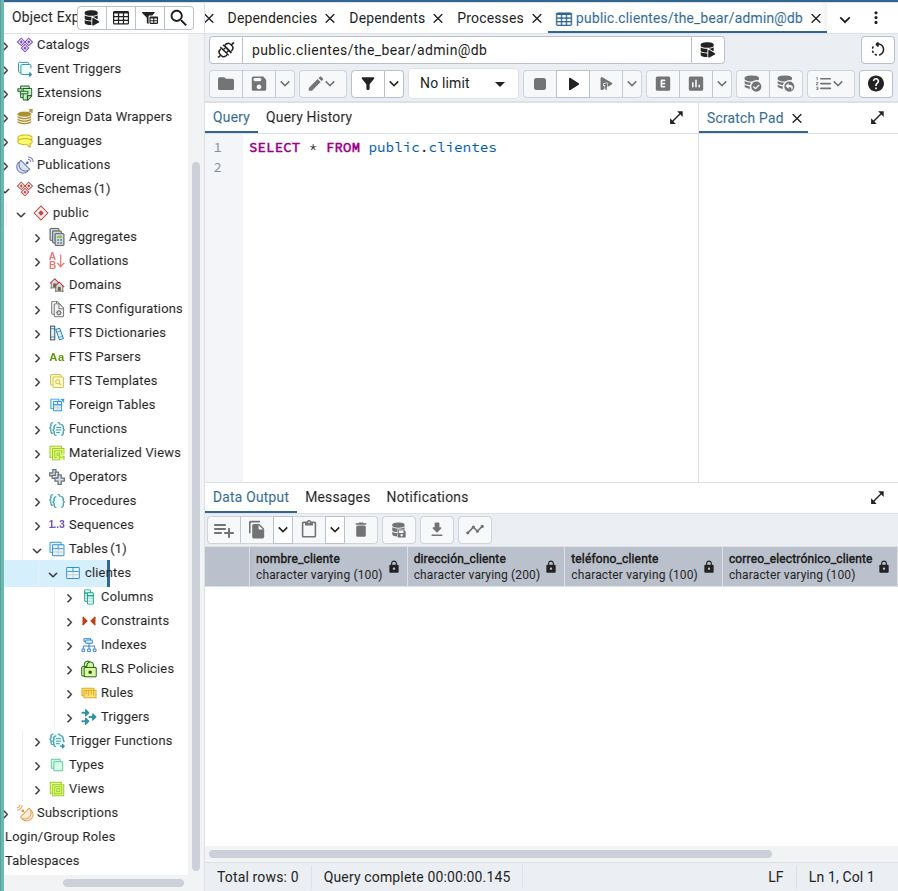
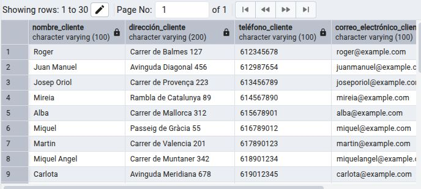

# BLOC 2
Yoon López Luis - DAM 1B

## ACTIVITAT 5 - PYTHON + POSTGRESQL

### PREPARACIÓ DE L'ENTORN

El primer que fem és crear l'estrictura d'arxius corresponent.

En aquest cas, tindrem els directoris següents:
`bloc2_Yoon` > `postgresql_python`

Dins de `postgresql_python`, desarem els arxius següents:
- `connect.py`
- `create_registre.py`
- `delete_registre.py`
- `main.py`
- `read_registre.py`
- `update_registre.py`


A continuació, indiquem al `connect.py` les dades de la connexió a la base de dades.


I comprovem que funciona, executant el programa amb un print al final de la connexió `print(connection_db)`

)

Aquest arxiu que hem creat ens servirà per establir la connexió amb la base de dades.

A continuació, hem de configurar el docker, creant un arxiu anomenat `docker-compose.yml` amb el següent contingut:

!(img/004)

Amb aquesta configuració, hem creat els serveis de la base de dades i el pgadmin per poder utilitzar més tard.

### CREACIÓ DOCKER

Un cop fet, hem d'activar el docker. És molt important tenir en compte que, un cop activat, no podem modificar-lo.

```commandline
sudo docker compose up -d
```
Que ha de donar el següent resultat en cas de ser correcte:
```commandline
[+] Running 2/2
 ✔ Container pg_erp  Running
 ✔ Container db_erp  Started   
```

**En cas d'error**, si l'error menciona que no ha pogut utilitzar el port, hem d'eliminar el procés que està executant el port.

Primer averigüem quin procés està executant el port:
```commandline
sudo lsof -i:5432
```
Eliminem el procés que està utilitzant el port; en aquest cas, era el procés amb PID 1935.
```commandline
sudo kill 1935
```
Un cop eliminat, podem tornar a executar el `docker compose up`.

Quan ja s'ha executat correctament, podem **veure els contenidors** actius; si afegim l'opció -a, apareixen també els inactius.
```commandline
sudo docker ps
```


**Parar un contenidor**
```commandline
sudo docker stop <nom contenidor>
```

**Eliminar un contenidor**
```commandline
sudo docker rm <nom contenidor>
```

Per **comprovar que funciona correctament**, entrem a pgadmin posant `localhost` al navegador, i s'hauria de mostrar la pàgina de pgadmin.


Les credencials per accedir son les indicades a les línies del pgadmin del document `docker-compose.yml`.


### PASSAR DADES DE CSV A LA BASE DE DADES

El que farem serà crear un script per passar les dades automàticament.

El primer que haurem de fer serà descarregar-nos el fitxer anomenat `Clientes.csv` a una carpeta anomenada `send_data_to_db`.

Dins de la mateixa carpeta, creem tres arxius:
- `create_table_to_db.py`: crea la taula amb els camps segons el csv.
- `csv_to_dict.py`: transforma la informació del csv en format diccionari.
- `dict_to_db.py` inserta les dades del diccionari a la base de dades.

Contingut de `create_table_to_db.py`:
```commandline
import psycopg2

def create_tables():
    conn = psycopg2.connect(
        database="the_bear",
        password="admin",
        user="admin",
        host="localhost",
        port="5432"
    )

    cursor = conn.cursor()

    sql_clients = '''
       CREATE TABLE Clientes (
       Nombre_Cliente VARCHAR(100),
       Dirección_Cliente VARCHAR(200),
       Teléfono_Cliente VARCHAR(100),
       Correo_Electrónico_Cliente VARCHAR(100),
       Fecha_Cumpleaños VARCHAR(50));'''

    cursor.execute(sql_clients)

    conn.commit()

    conn.close()
    cursor.close()

    return {"Tables created successfully"}
```
Contingut de `dict_to_db.py`:
```commandline
import dict_to_db as d_t_db
import pandas as pd

def csv_to_dict():
  df = pd.read_csv("Clientes.csv")
  d = df.to_dict(orient='list')
  return d

data = csv_to_dict()

for i in range(30):
  d_t_db.send_data_to_db(i, data)
```

Contingut de `dict_to_db.py`:
```commandline
import dict_to_db as d_t_db
import pandas as pd

def csv_to_dict():
    print(data)
    conn = psycopg2.connect(
        database="the_bear",
        password="admin",
        user="admin",
        host="localhost",
        port="5432"
    )

    cur = conn.cursor()
    sql = "INSERT INTO Clientes (nombre_cliente, dirección_cliente, teléfono_cliente, correo_electrónico_cliente, fecha_cumpleaños) VALUES (%s, %s, %s, %s, %s);"
    values = (data["Nombre_cliente"][pos], data["Dirección_Cliente"][pos], data["Teléfono_Cliente"][pos], data["Correo_Electrónico_Cliente"][pos], data["Fecha_Cumpleaños"][pos])

    cur.execute(sql,values)
    conn.commit()

    cur.close()
    conn.commit()

    return {"M"}
```

Comprovem que funciona executant els dos primers arxius creats.

En executar `create_table_to_db.py`, al terminal sortirà que s'ha executat el procés amb exit code 0.
Això significa que s'ha executat correctament, i ho comprovem veient la base de dades creada al pgadmin.


Després, executem `csv_to_dict.py` i de nou, veurem com finalitza amb exit code 0. Veiem que s'ha fet de nou, des de pgadmin. Aquest, dins del seu programa, ja executa l'altre arxiu, pel que no cal fer-ho manualment.
