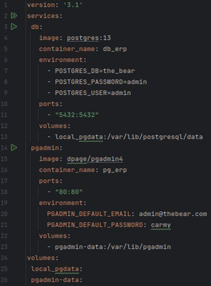

# BLOC 2
Yoon López Luis - DAM 1B

## ACTIVITAT 5 - PYTHON + POSTGRESQL

El primer que fem és crear l'estrictura d'arxius corresponent.

En aquest cas, tindrem els directoris següents:
`bloc2_Yoon` > `postgresql_python`

Dins de `postgresql_python`, desarem els arxius següents:
- `connect.py`
- `create_registre.py`
- `delete_registre.py`
- `main.py`
- `read_registre.py`
- `update_registre.py`

A continuació, indiquem al `connect.py` les dades de la connexió a la base de dades.

I comprovem que funciona, executant el programa amb un print al final de la connexió `print(connection_db)`

)

Aquest arxiu que hem creat ens servirà per establir la connexió amb la base de dades.

A continuació, hem de configurar el docker, creant un arxiu anomenat `docker-compose.yml` amb el següent contingut:

!(img/004)

